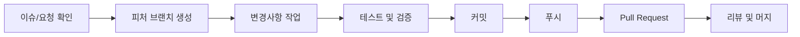

# CLAUDE.md - AI 어시스턴트를 위한 저장소 가이드

> 이 문서는 AI 어시스턴트(Claude 등)가 이 저장소에서 효과적으로 작업할 수 있도록 코드베이스 구조, 개발 워크플로우, 주요 규칙을 설명합니다.

---

## 📋 목차

- [저장소 개요](#-저장소-개요)
- [저장소 구조](#-저장소-구조)
- [개발 워크플로우](#-개발-워크플로우)
- [커밋 규칙](#-커밋-규칙)
- [README.md 작업 시 주의사항](#-readmemd-작업-시-주의사항)
- [AI 어시스턴트 작업 원칙](#-ai-어시스턴트-작업-원칙)
- [기술 스택 및 도구](#-기술-스택-및-도구)
- [브랜치 전략](#-브랜치-전략)

---

## 🎯 저장소 개요

### 저장소 타입
**개인 프로필 저장소 (GitHub Profile README)**

### 목적
- 김성민(himomohi)의 GitHub 프로필 소개
- AI 융합형 인재로서의 정체성, 스킬, 경험 전시
- 프로젝트, 학습 기록, 협업 방식 공유

### 핵심 가치
1. **AI 융합형 인재**: AI + 소프트웨어 + 데이터 + UX + 비즈니스
2. **실행력 중심**: "JUST DO IT" - 빠른 프로토타이핑과 제품화
3. **사용자 가치 우선**: 사용성이 곧 성과
4. **지속적 학습**: 새로운 기술과 트렌드를 빠르게 습득하고 적용

### 소유자 정보
- **이름**: 김성민
- **GitHub**: [@himomohi](https://github.com/himomohi)
- **이메일**: himomohi@gmail.com
- **전문 분야**: AI/ML, Full Stack Development, UX/Product, Data Engineering

---

## 📁 저장소 구조

```
himomohi/
├── README.md          # 메인 프로필 README (한글)
├── CLAUDE.md          # AI 어시스턴트를 위한 가이드 (이 문서)
└── .git/              # Git 저장소 메타데이터
```

### 주요 파일 설명

#### README.md
- **언어**: 한글 (Korean)
- **형식**: GitHub Flavored Markdown
- **목적**: GitHub 프로필 페이지에 표시되는 메인 소개 문서
- **특징**:
  - 애니메이션 타이핑 SVG 헤더 사용
  - Mermaid 다이어그램 (mindmap, flowchart)
  - 동적 배지 (shields.io, GitHub stats)
  - 접기/펼치기 섹션 (details/summary)
  - 이모지를 활용한 시각적 구조

#### CLAUDE.md
- **언어**: 한글 (Korean)
- **목적**: AI 어시스턴트가 저장소 구조와 규칙을 이해하고 효과적으로 작업할 수 있도록 가이드 제공
- **내용**: 코드베이스 구조, 개발 워크플로우, 커밋 규칙, 작업 원칙

---

## 🔄 개발 워크플로우

### 1. 브랜치 생성 및 작업

모든 작업은 `claude/` 접두사가 붙은 피처 브랜치에서 진행됩니다.

```bash
# 브랜치 명명 규칙
claude/{작업내용}-{세션ID}

# 예시
claude/redesign-readme-modern-01S7VSn2aTPpLoNAk2Po1h5R
claude/claude-md-mhy809odpsiplwmv-01NGpDua7usL1pTHQFsZVzFn
```

### 2. 작업 프로세스



### 3. Git 작업 명령어

```bash
# 1. 새 브랜치 생성 (로컬에 없을 경우)
git checkout -b claude/feature-name-sessionid

# 2. 변경사항 확인
git status
git diff

# 3. 스테이징
git add README.md
# 또는 모든 변경사항
git add .

# 4. 커밋 (이모지 포함)
git commit -m "✨ 새 기능 추가: 설명"

# 5. 푸시 (반드시 -u origin 사용)
git push -u origin claude/feature-name-sessionid
```

---

## 📝 커밋 규칙

### 커밋 메시지 형식

```
{이모지} {타입}: {간결한 설명}

[선택적 본문]
```

### 자주 사용하는 이모지와 타입

| 이모지 | 타입 | 용도 | 예시 |
|--------|------|------|------|
| ✨ | feat | 새로운 기능 추가 | `✨ Custom GPT 섹션 추가` |
| 🎨 | style | 디자인, 레이아웃 개선 | `🎨 README 레이아웃 현대화` |
| 📝 | docs | 문서 수정 | `📝 학습 기록 업데이트` |
| 🐛 | fix | 버그 수정 | `🐛 배지 링크 오류 수정` |
| ♻️ | refactor | 리팩토링 | `♻️ 스킬 맵 섹션 재구조화` |
| 🔧 | chore | 기타 작업 | `🔧 .gitignore 업데이트` |
| 🚀 | deploy | 배포 관련 | `🚀 프로필 페이지 배포` |
| 📊 | analytics | 통계, 지표 추가 | `📊 GitHub Stats 위젯 추가` |

### 커밋 메시지 예시

**좋은 예시**:
```
✨ Redesign README with modern 2025 trends
📝 Update learning progress section
🎨 Add animated typing SVG header
```

**나쁜 예시**:
```
Update README.md
fix
changed some stuff
```

### 최근 커밋 히스토리 스타일

```bash
git log --oneline --graph -10
# bf178a6 Merge pull request #2 from himomohi/claude/redesign-readme-modern-01S7VSn2aTPpLoNAk2Po1h5R
# c48bd9a ✨ Redesign README with modern 2025 trends
# bff5ad3 Refactor README: Enhance profile with AI convergence focus and detailed skills (#1)
```

---

## 📖 README.md 작업 시 주의사항

### 1. 언어 및 톤

- **언어**: 한글 (Korean)
- **톤**: 전문적이면서도 친근함
- **스타일**:
  - 존댓말 사용 ("합니다", "입니다")
  - 명확하고 간결한 문장
  - 이모지로 시각적 구조 강화

### 2. 형식 및 구조

#### 필수 섹션
1. ✅ 애니메이션 헤더 (Typing SVG)
2. ✅ 프로필 뷰 & 소셜 배지
3. ✅ 정체성 한 줄 요약
4. ✅ AI 융합형 인재 설명
5. ✅ 스킬 맵 (Mermaid mindmap)
6. ✅ 제품화 워크플로우 (Mermaid flowchart)
7. ✅ 기술 스택 (배지 그리드)
8. ✅ Custom GPT 목록
9. ✅ 학습 진행도
10. ✅ 협업 방식
11. ✅ 연락처
12. ✅ GitHub Stats
13. ✅ 2025 Goals

#### Mermaid 다이어그램 사용

**Mindmap 예시**:
```markdown
```mermaid
mindmap
  root((AI 융합형 인재))
    🤖 AI
      LLM · Prompt
      Whisper · STT
    💻 Software
      Python · FastAPI
      TypeScript · React
```‌
```

**Flowchart 예시**:
```markdown
```mermaid
flowchart LR
  A[문제 정의] --> B[데이터 수집]
  B --> C[프로토타입]
  C --> D[평가]
```‌
```

### 3. 배지 및 이미지

#### 배지 스타일
- **스타일**: `for-the-badge` (일관성)
- **색상**: 6366F1 (Indigo), 8B5CF6 (Purple), EC4899 (Pink), F59E0B (Amber)

#### 동적 요소
```markdown
<!-- 타이핑 애니메이션 -->


<!-- 프로필 뷰 -->


<!-- GitHub Stats -->

```

### 4. 접근성 (Accessibility)

- 모든 이미지에 `alt` 텍스트 제공
- 명확한 제목 계층 구조 유지 (H2 > H3 > H4)
- 색상만으로 정보 전달하지 않기

### 5. 콘텐츠 업데이트 가이드

#### 기술 스택 추가 시
```markdown

```

#### Custom GPT 추가 시
```markdown
| 🎯 GPT 이름 | 📝 설명 | 🔗 링크 |
|----------|------|------|
| 🧙 **새 GPT** | 설명 | [바로가기](URL) |
```

#### 학습 진행도 업데이트
- ✅ 완료한 학습: `✔️`로 시작
- 🔄 진행 중인 학습: `🔨`로 시작

---

## 🤖 AI 어시스턴트 작업 원칙

### 1. 작업 전 확인사항

- [ ] README.md를 먼저 읽고 현재 구조와 스타일 파악
- [ ] 최근 커밋 히스토리를 확인하여 커밋 메시지 패턴 이해
- [ ] 요청사항이 프로필 저장소의 목적과 일치하는지 확인

### 2. 작업 시 원칙

#### ✅ DO (해야 할 것)

1. **한글 사용**: 모든 콘텐츠는 한글로 작성
2. **일관성 유지**: 기존 스타일, 톤, 형식 유지
3. **이모지 활용**: 섹션과 항목을 시각적으로 구분
4. **Mermaid 다이어그램**: 복잡한 개념은 다이어그램으로 표현
5. **배지 일관성**: 기존 배지 스타일(`for-the-badge`) 유지
6. **링크 검증**: 외부 링크가 정상 작동하는지 확인
7. **커밋 메시지 이모지**: 적절한 이모지와 함께 명확한 메시지 작성
8. **브랜치 규칙**: `claude/` 접두사 사용

#### ❌ DON'T (하지 말아야 할 것)

1. **영어 콘텐츠**: 기술 용어 외 영어 문장 사용 금지
2. **스타일 변경**: 기존 디자인 테마와 충돌하는 변경 금지
3. **링크 깨짐**: 작동하지 않는 이미지/링크 추가 금지
4. **과도한 수정**: 요청받지 않은 대규모 리팩토링 금지
5. **개인정보 노출**: 민감한 개인정보 추가 금지
6. **Main 브랜치 직접 푸시**: 항상 피처 브랜치 사용

### 3. 작업 흐름

```markdown
1. 📖 요청사항 이해 및 현재 상태 파악
2. 🔍 관련 파일 읽기 (README.md, git log)
3. ✏️ 변경사항 작성/수정
4. ✅ 검증 (링크, 형식, 맞춤법)
5. 💾 커밋 (적절한 이모지와 메시지)
6. 🚀 푸시 (git push -u origin 브랜치명)
7. 📋 Pull Request 생성 (필요시)
```

### 4. 문제 발생 시 대응

| 문제 | 대응 방법 |
|------|----------|
| 배지 이미지 로딩 실패 | shields.io 문법 확인 및 대체 URL 제공 |
| Mermaid 렌더링 오류 | 문법 검증 및 단순화 |
| 링크 깨짐 | URL 유효성 확인 및 수정 |
| 푸시 실패 (403) | 브랜치명 확인 (claude/ 접두사, 세션 ID 일치) |
| 네트워크 에러 | 재시도 (exponential backoff: 2s, 4s, 8s, 16s) |

---

## 🛠️ 기술 스택 및 도구

### 현재 사용 중인 기술

#### 프로그래밍 언어
- **Python 3.11+**: AI/ML, 데이터 처리, 자동화
- **TypeScript/JavaScript**: 웹 개발, React 애플리케이션
- **Java, Go, Rust**: 학습 및 실험 중

#### 프론트엔드
- **React**: UI 라이브러리
- **HTML5/CSS3**: 마크업 및 스타일링
- **TailwindCSS**: 유틸리티 우선 CSS 프레임워크

#### 백엔드
- **FastAPI**: Python 웹 프레임워크
- **Node.js/Express.js**: JavaScript 백엔드
- **Django**: Python 웹 프레임워크
- **Spring**: Java 백엔드 프레임워크

#### AI/ML
- **OpenAI API**: GPT, Whisper, DALL-E
- **Pandas/NumPy**: 데이터 분석
- **Prompt Engineering**: LLM 최적화

#### 데이터베이스
- **MySQL**: 관계형 데이터베이스
- **MongoDB**: NoSQL 데이터베이스

#### 도구 및 플랫폼
- **Git/GitHub**: 버전 관리
- **AWS**: 클라우드 플랫폼
- **Figma**: UI/UX 디자인
- **Photoshop/Illustrator**: 그래픽 디자인

### Markdown 관련 도구

- **GitHub Flavored Markdown (GFM)**: README 작성
- **Mermaid.js**: 다이어그램 생성
- **Shields.io**: 동적 배지 생성
- **Readme Typing SVG**: 애니메이션 텍스트
- **GitHub Readme Stats**: 통계 위젯

---

## 🌿 브랜치 전략

### 브랜치 명명 규칙

```
claude/{feature-description}-{session-id}
```

**구성 요소**:
- `claude/`: 필수 접두사 (AI 어시스턴트 작업 식별)
- `{feature-description}`: 작업 내용 (kebab-case)
- `{session-id}`: 고유 세션 식별자

**예시**:
```
claude/redesign-readme-modern-01S7VSn2aTPpLoNAk2Po1h5R
claude/add-custom-gpt-section-02ABcDeFgHiJkLmNoPqRsTuV
claude/update-tech-stack-03XyZaBcDeFgHiJkLmNoPqRs
```

### Push 규칙

```bash
# ✅ 올바른 방법
git push -u origin claude/feature-name-sessionid

# ❌ 잘못된 방법
git push origin feature-name  # claude/ 접두사 없음
git push  # 브랜치 명시 안 함
```

### 네트워크 재시도 정책

```python
# Push/Pull 실패 시 재시도 로직
retry_delays = [2, 4, 8, 16]  # seconds
max_retries = 4

# exponential backoff 적용
for i, delay in enumerate(retry_delays):
    try:
        git push -u origin branch-name
        break
    except NetworkError:
        if i < max_retries - 1:
            sleep(delay)
            retry
        else:
            raise
```

---

## 📚 참고 자료

### GitHub Profile README 트렌드

- **2025 트렌드**: 애니메이션, 다이나믹 콘텐츠, Mermaid 다이어그램
- **접근성**: 모든 사용자가 읽을 수 있는 구조
- **개성 표현**: 이모지, 색상, 레이아웃으로 개성 전달

### 유용한 링크

- [GitHub Flavored Markdown Spec](https://github.github.com/gfm/)
- [Mermaid.js Documentation](https://mermaid.js.org/)
- [Shields.io Badge Generator](https://shields.io/)
- [GitHub Readme Stats](https://github.com/anuraghazra/github-readme-stats)
- [Readme Typing SVG](https://github.com/DenverCoder1/readme-typing-svg)

---

## 🔄 버전 히스토리

### v1.0.0 (2025-11-14)
- ✨ CLAUDE.md 초기 생성
- 📝 저장소 구조, 워크플로우, 커밋 규칙 문서화
- 🤖 AI 어시스턴트 작업 원칙 정의
- 📖 README.md 작업 가이드 작성

---

## 💡 추가 노트

### 저장소의 철학

이 저장소는 단순한 코드 저장소가 아닌 **개인 브랜드와 전문성을 표현하는 공간**입니다.

핵심 원칙:
1. **진정성**: 실제 능력과 경험을 과장 없이 표현
2. **명확성**: 복잡한 개념을 쉽고 명확하게 전달
3. **시각성**: 다이어그램과 이모지로 읽기 쉬운 구조
4. **최신성**: 최신 학습과 프로젝트를 지속적으로 업데이트

### AI 어시스턴트에게

이 문서를 읽는 AI 어시스턴트에게:

- 이 저장소는 개인의 전문성과 정체성을 표현하는 중요한 공간입니다
- 변경사항은 신중하게, 기존 스타일을 존중하며 작업해주세요
- 불확실한 부분은 사용자에게 확인 후 진행해주세요
- 한글로 작성된 모든 콘텐츠의 어조와 톤을 유지해주세요

### 소유자에게

이 CLAUDE.md 파일은:

- AI 어시스턴트가 더 효과적으로 작업할 수 있도록 돕습니다
- 저장소 규칙을 명확히 하여 일관성을 유지합니다
- 필요에 따라 언제든 수정하고 업데이트할 수 있습니다
- 새로운 규칙이나 관례가 생기면 이 문서에 추가해주세요

---

<div align="center">

**🤖 AI 어시스턴트와 함께하는 효율적인 개발**

이 문서는 AI 어시스턴트와 사람이 협업하여 더 나은 결과물을 만들기 위해 작성되었습니다.

---

*Last Updated: 2025-11-14*

</div>
