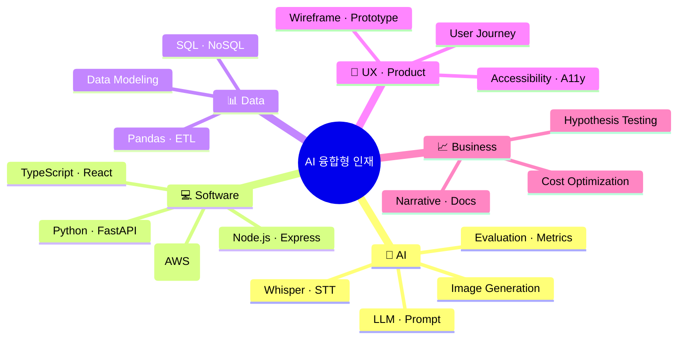

<div align="center">

<!-- Animated Typing Header -->


<!-- Animated Quote -->


<br/>

AI 기술을 실용적인 제품으로 연결하는 **AI 융합형 인재(Convergence Talent)** 입니다.
데이터·AI·소프트웨어 엔지니어링·UX·비즈니스의 교차점에서 **빠르게 학습하고, 즉시 적용하며, 끝까지 제품화**합니다.

<br/>

<!-- Profile Views & Social Badges -->

[](mailto:himomohi@gmail.com)
[](https://github.com/himomohi)

<!-- Dynamic Status Badges -->


</div>

<br/>

---

<div align="center">

## 📌 빠른 안내 (Table of Contents)

[🧭 정체성](#-정체성-한-줄-요약) •
[🧩 AI 융합형 인재](#-ai-융합형-인재란) •
[🧠 스킬 맵](#-스킬-맵mindmap) •
[🏗️ 워크플로우](#️-제품화-중심-ai-워크플로우) •
[🛠️ 기술 스택](#️-기술-스택-tech-stack) •
[🤖 Custom GPT](#-내가-만든-custom-gpt) •
[🌱 학습 중](#-요즘-배우고-있어요-learning-in-progress) •
[🤝 협업 방식](#-협업-방식) •
[📫 연락하기](#-연락하기)

</div>

<a id="top"></a>

---

## 🧭 정체성 한 줄 요약

<div align="center">

```diff
+ AI + 소프트웨어 + 데이터 + UX + 비즈니스를 융합해,
+ 문제를 정의하고 끝까지 제품으로 만드는 사람
```

</div>

<table>
<tr>
<td width="33%" align="center">
<b>⚡ 실전 중심</b><br/>
프로토타입 → 피드백 → 개선 → 제품화
</td>
<td width="33%" align="center">
<b>⚖️ 속도와 품질의 균형</b><br/>
빠른 실험과 일관된 코드/설계
</td>
<td width="33%" align="center">
<b>👥 사용자 가치 최우선</b><br/>
사용성이 곧 성과라고 믿습니다
</td>
</tr>
</table>

---

## 🧩 AI 융합형 인재란?

<details open>
<summary>👆 클릭하여 펼쳐보기</summary>

<br/>

다양한 영역을 가로지르는 **T-자형(깊이)+π-자형(다중-깊이)** 역량 구조를 갖춘 인재를 뜻합니다.

<table>
<tr>
<td width="25%">

### 🤖 AI/데이터 이해
- LLM
- Prompt Engineering
- Whisper
- 이미지 생성
- 평가·지표 설계

</td>
<td width="25%">

### 💻 엔지니어링
- Python/TypeScript
- React/Node
- FastAPI
- 데이터 파이프라인
- 배포/운영

</td>
<td width="25%">

### 🎨 UX/제품감
- 문제 정의
- 사용자 여정
- 마이크로 인터랙션
- 측정/분석

</td>
<td width="25%">

### 📊 비즈니스
- 가설-검증
- 비용·효율 최적화
- 문서화
- 스토리텔링

</td>
</tr>
</table>

<br/>

</details>

---

## 🧠 스킬 맵(Mindmap)

<div align="center">



</div>

---

## 🏗️ 제품화 중심 AI 워크플로우

```mermaid
%%{init: {'theme':'base', 'themeVariables': { 'primaryColor':'#6366f1','primaryTextColor':'#fff','primaryBorderColor':'#4f46e5','lineColor':'#8b5cf6','secondaryColor':'#ec4899','tertiaryColor':'#f59e0b'}}}%%
flowchart LR
  A[📋 문제 정의<br/>목표지표 설정] --> B[📦 데이터/지식 수집<br/>전처리]
  B --> C[🔧 모델/도구 선택<br/>프롬프트 전략]
  C --> D[⚡ 프로토타입 구현<br/>빠른 실험]
  D --> E[📊 평가/지표 측정<br/>리그레션 방지]
  E --> F[🚀 웹/앱 제품화<br/>배포/모니터링]
  F --> G[🔄 사용자 피드백<br/>지속 개선]

  style A fill:#6366f1,stroke:#4f46e5,stroke-width:2px,color:#fff
  style B fill:#8b5cf6,stroke:#7c3aed,stroke-width:2px,color:#fff
  style C fill:#a855f7,stroke:#9333ea,stroke-width:2px,color:#fff
  style D fill:#ec4899,stroke:#db2777,stroke-width:2px,color:#fff
  style E fill:#f59e0b,stroke:#d97706,stroke-width:2px,color:#fff
  style F fill:#10b981,stroke:#059669,stroke-width:2px,color:#fff
  style G fill:#3b82f6,stroke:#2563eb,stroke-width:2px,color:#fff
```

<div align="center">



</div>

<details>
<summary>📝 세부 원칙 보기</summary>

<br/>

- ✅ 가설을 명확히 서술하고, **측정 가능한 지표**로 정의합니다.
- ✅ 데이터·모델 선택보다 **사용자 문제**를 우선합니다.
- ✅ 평가 기준을 문서화해 **재현 가능 실험**을 만듭니다.
- ✅ 배포 후 **관찰 가능성(Observability)**를 확보합니다.

</details>

---

## 🛠️ 기술 스택 (Tech Stack)

<div align="center">

### 💻 Languages


### 🎨 Frontend


### ⚙️ Backend


### 🗄️ Database


### 🤖 AI & Data


### 🛠️ Tools & Platforms


</div>

<br/>

<div align="center">

> 💡 주로 **Python** 기반 자동화, 데이터 처리, AI 연동, 웹 제품화를 수행합니다.

</div>

---

## 🤖 내가 만든 Custom GPT

<div align="center">

| 🎯 GPT 이름 | 📝 설명 | 🔗 링크 |
|----------|------|------|
| 🧙 **VBA MASTER!** | 엑셀 VBA 매크로 코드를 자동 생성하는 GPT | [바로가기](https://chat.openai.com/g/g-MaUnLcGuA-vbamaster) |
| 🎨 **Logo and Text Design Expert** | 텍스트를 기반으로 로고 제작 방향을 제시 | [바로가기](https://chat.openai.com/g/g-tSnE7MhMS-logo-and-text-design-expert) |
| 📸 **SNS Posing** | 업로드된 사진을 분석하여 SNS용 포스팅 문구 생성 | [바로가기](https://chat.openai.com/g/g-JSqVYW2E3-sns-posting) |

</div>

<br/>

<div align="center">

> 🚀 GPT를 **도구를 넘어 협업 파트너**로 활용합니다.

</div>

---

## 🌱 요즘 배우고 있어요 (Learning in Progress)

<div align="center">

### 📚 현재 학습 진행도

</div>

<table>
<tr>
<td width="50%">

#### ✅ 완료한 학습

- ✔️ OpenAI API 심화 · 프롬프트 엔지니어링 패턴화
- ✔️ Whisper 파이프라인 · 감정/톤 분석 실험
- ✔️ 이미지 생성 · 스타일 일관성(시드·컨디셔닝)

</td>
<td width="50%">

#### 🔄 진행 중인 학습

- 🔨 FastAPI 기반 API 서버 심화 · 모듈러 설계
- 🔨 데이터 정제/자동화(ETL) 고도화 · 품질지표 설계
- 🔨 웹 접근성 · 반응형 UX 개선 · 마이크로 인터랙션

</td>
</tr>
</table>

<details>
<summary>📖 AI 학습 기록 자세히 보기</summary>

<br/>

### 🎓 세부 학습 내용

#### 🧠 LLM(대형언어모델)의 원리와 구조
- Transformer, Attention 메커니즘
- GPT 시리즈 아키텍처

#### 🔌 OpenAI API 활용법
- `chat/completions` 엔드포인트 마스터
- 프롬프트 엔지니어링 패턴
- 오류 처리(`529 overloaded_error` 등)

#### 🎤 음성 → 텍스트
- Whisper 통합
- 감정/말투 분석 흐름

#### 🎨 AI 이미지 생성
- 애니/지브리/K-pop 스타일
- 시드 고정과 일관성 유지

#### 🖥️ AI 기반 GUI
- 텍스트→코드 변환
- GUI 요소 자동 생성
- 인코딩 자동 판별

</details>

---

## 🤝 협업 방식

<div align="center">

<table>
<tr>
<td align="center" width="25%">

### 📝 문서 우선
결정과 가설, 실험과 결과를<br/>
**짧고 명확하게 기록**

</td>
<td align="center" width="25%">

### 🔄 작은 배치
위험은 작게, 가치는 빠르게<br/>
**연속 전달(CD)** 지향

</td>
<td align="center" width="25%">

### 👥 사용성 테스트
정량/정성<br/>
**사용자 피드백 루프** 설계

</td>
<td align="center" width="25%">

### 💎 코드 품질
타입 기반 계약, 가드 클로즈<br/>
**에러 핸들링, 관찰 가능성**

</td>
</tr>
</table>

</div>

---

## 📫 연락하기

<div align="center">

### 💌 Let's Build Something Amazing Together!

<br/>

[](mailto:himomohi@gmail.com)
[](https://github.com/himomohi)

<br/>

**함께 만들고 싶은 아이디어가 있다면, 지금 연락 주세요.**
**AI로 실용적인 가치를 함께 만들어갑니다.** 🚀

</div>

---

<div align="center">

### 📊 GitHub Stats


</div>

---

<div align="center">

### 🎯 2025 Goals

```typescript
const goals2025 = {
  learning: ["Advanced LLM Orchestration", "Rust Production Apps", "Cloud Native Architecture"],
  building: ["AI-Powered Productivity Tools", "Developer Experience Enhancers"],
  contributing: ["Open Source AI Projects", "Tech Community Building"],
  growing: ["Technical Writing", "Public Speaking", "Mentoring"]
};
```

</div>

---

<div align="center">


<br/>

> 💡 이 저장소는 저의 실험과 학습, 그리고 **AI 제품화 여정**을 기록합니다.

<br/>

[](https://github.com/himomohi)

<br/>

**[⬆️ 맨 위로 돌아가기](#top)**

</div>
