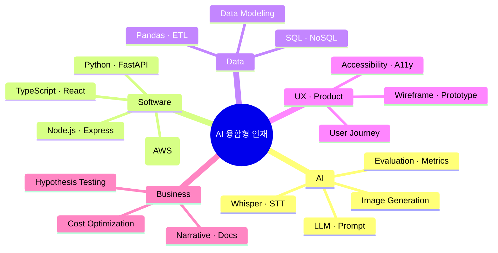
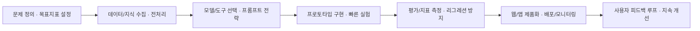

# 🚀 AI 융합형 인재 | 실행하는 개발자 김성민

> "JUST DO IT." – 실행력이 최고의 무기다

AI 기술을 실용적인 제품으로 연결하는 **AI 융합형 인재(Convergence Talent)** 입니다. 
데이터·AI·소프트웨어 엔지니어링·UX·비즈니스의 교차점에서 **빠르게 학습하고, 즉시 적용하며, 끝까지 제품화**합니다.

  
  
  
  
  

---

## 📌 빠른 안내 (Table of Contents)

- [정체성 한 줄 요약](#-정체성-한-줄-요약)
- [AI 융합형 인재란?](#-ai-융합형-인재란)
- [스킬 맵(Mindmap)](#-스킬-맵mindmap)
- [제품화 중심 AI 워크플로우](#-제품화-중심-ai-워크플로우)
- [기술 스택](#-기술-스택-tech-stack)
- [내가 만든 Custom GPT](#-내가-만든-custom-gpt)
- [요즘 배우고 있어요](#-요즘-배우고-있어요-learning-in-progress)
- [협업 방식](#-협업-방식)
- [연락하기](#-연락하기)

---

## 🧭 정체성 한 줄 요약

**AI + 소프트웨어 + 데이터 + UX + 비즈니스**를 융합해, **문제를 정의하고 끝까지 제품으로 만드는 사람**.

- 실전 중심: 프로토타입 → 사용자 피드백 → 개선 → 제품화
- 속도와 품질의 균형: 빠른 실험과 일관된 코드/설계
- 사용자 가치 최우선: 사용성이 곧 성과라고 믿습니다

---

## 🧩 AI 융합형 인재란?

펼쳐보기

다양한 영역을 가로지르는 **T-자형(깊이)+π-자형(다중-깊이)** 역량 구조를 갖춘 인재를 뜻합니다.

- **AI/데이터 이해**: LLM, Prompt Engineering, Whisper, 이미지 생성, 평가·지표 설계
- **엔지니어링**: Python/TypeScript, React/Node, FastAPI, 데이터 파이프라인, 배포/운영
- **UX/제품감**: 문제 정의 → 사용자 여정 → 마이크로 인터랙션 → 측정/분석
- **비즈니스**: 가설-검증, 비용·효율 최적화, 전달력 있는 문서화·스토리텔링

아래 마인드맵과 플로우차트로 제 역량과 사고 흐름을 한눈에 볼 수 있습니다.

---

## 🧠 스킬 맵(Mindmap)

---

## 🏗️ 제품화 중심 AI 워크플로우

세부 원칙 보기

- 가설을 명확히 서술하고, **측정 가능한 지표**로 정의합니다.
- 데이터·모델 선택보다 **사용자 문제**를 우선합니다.
- 평가 기준을 문서화해 **재현 가능 실험**을 만듭니다.
- 배포 후 **관찰 가능성(Observability)**를 확보합니다.

---

## 🛠️ 기술 스택 (Tech Stack)

| 영역 | 기술 |
|------|------|
| **언어** | Python 🐍, Java ☕, JavaScript, TypeScript, Go(학습 중), Rust(학습 중) |
| **프론트엔드** | HTML, CSS, React, Tailwind CSS, TypeScript |
| **백엔드** | Node.js, Express.js, FastAPI, Django, Spring 일부 경험 |
| **데이터베이스** | MySQL, MongoDB |
| **AI/데이터** | OpenAI API, Whisper, Prompt Engineering, 이미지 생성, Pandas |
| **도구** | Git, AWS, Figma, Photoshop, Illustrator, AutoCAD, 3DS Max |

> 주로 **Python** 기반 자동화, 데이터 처리, AI 연동, 웹 제품화를 수행합니다.

---

## 🤖 내가 만든 Custom GPT

| GPT 이름 | 설명 |
|----------|------|
| [🧙 VBA MASTER!](https://chat.openai.com/g/g-MaUnLcGuA-vbamaster) | 엑셀 VBA 매크로 코드를 자동 생성하는 GPT |
| [🎨 Logo and Text Design Expert](https://chat.openai.com/g/g-tSnE7MhMS-logo-and-text-design-expert) | 텍스트를 기반으로 로고 제작 방향을 제시 |
| [📸 SNS Posing](https://chat.openai.com/g/g-JSqVYW2E3-sns-posting) | 업로드된 사진을 분석하여 SNS용 포스팅 문구 생성 |

> GPT를 **도구를 넘어 협업 파트너**로 활용합니다.

---

## 🌱 요즘 배우고 있어요 (Learning in Progress)

- [x] OpenAI API 심화 · 프롬프트 엔지니어링 패턴화
- [x] Whisper 파이프라인 · 감정/톤 분석 실험
- [x] 이미지 생성 · 스타일 일관성(시드·컨디셔닝)
- [ ] FastAPI 기반 API 서버 심화 · 모듈러 설계
- [ ] 데이터 정제/자동화(ETL) 고도화 · 품질지표 설계
- [ ] 웹 접근성 · 반응형 UX 개선 · 마이크로 인터랙션

AI 학습 기록 펼쳐보기

- **LLM(대형언어모델)의 원리와 구조**: Transformer, Attention, GPT 시리즈
- **OpenAI API 활용법**: `chat/completions`, 프롬프트 엔지니어링, 오류 처리(`529 overloaded_error` 등)
- **음성 → 텍스트**: Whisper, 감정/말투 분석 흐름
- **AI 이미지 생성**: 애니/지브리/K-pop 스타일, 시드 고정과 일관성 유지
- **AI 기반 GUI**: 텍스트→코드 변환, GUI 요소 자동 생성, 인코딩 자동 판별

---

## 🤝 협업 방식

원칙 보기

- 문서 우선: 결정과 가설, 실험과 결과를 **짧고 명확하게 기록**합니다.
- 작은 배치: 위험은 작게, 가치는 빠르게. **연속 전달(Continuous Delivery)** 지향.
- 사용성 테스트: 정량/정성 **사용자 피드백 루프**를 설계합니다.
- 코드 품질: 타입 기반 계약, 가드 클로즈, 에러 핸들링, 관찰 가능성.

---

## 📫 연락하기

- 이메일: **himomohi@gmail.com**
- 함께 만들고 싶은 아이디어가 있다면, 지금 연락 주세요. **AI로 실용적인 가치를 함께 만들어갑니다.**

---

> 감사합니다. 이 저장소는 저의 실험과 학습, 그리고 **AI 제품화 여정**을 기록합니다.

<a href="#top">맨 위로 ↑</a>

