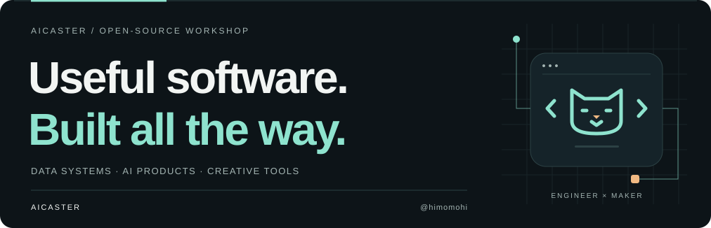

<strong>English</strong> · <a href="./README.ko.md">한국어</a>

<picture>
  <source media="(prefers-color-scheme: dark)" srcset="./assets/profile-dark.svg">
  <source media="(prefers-color-scheme: light)" srcset="./assets/profile-light.svg">
  
</picture>

<h1 align="center">AICASTER · Appcaster</h1>

  <strong>Applied AI Engineer · AI Agents · Data Systems</strong> 
  Building as Appcaster · <a href="https://github.com/himomohi">@himomohi</a>

  <a href="#selected-work">Selected work</a> ·
  <a href="#what-i-bring">Capabilities</a> ·
  <a href="#open-source-contributions">Contributions</a> ·
  <a href="#connect">Connect</a>

I build AI agents, developer tools, and production software — from data and model integration to UX, testing, and release. My work spans **data engineering, AI integrations, native desktop apps, and creative developer tools**.

I like the whole journey: understanding the problem, shaping the experience, implementing it, and staying with it through testing, release, and improvement.

## Selected work

<table>
<tr>
<td width="50%" valign="top">
<h3><a href="https://github.com/himomohi/AirTranslate">01 / AirTranslate</a></h3>

<strong>Live captions for whatever your Mac is playing.</strong>

A macOS app for system-audio transcription, translation, and floating captions. Apple frameworks provide the default path, with optional AI-provider integrations.

<code>Swift</code> <code>SwiftUI</code> <code>ScreenCaptureKit</code>

<strong>What it shows:</strong> native app development, real-time audio workflows, and ongoing product iteration.

<a href="https://himomohi.github.io/AirTranslate/">Product guide</a> · <a href="https://github.com/himomohi/AirTranslate/releases">Releases</a>

427 stars · 45 forks on GitHub, checked 2026-09-06.
</td>
<td width="50%" valign="top">
<h3><a href="https://github.com/himomohi/pixelforge-studio">02 / PixelForge Studio</a></h3>

<strong>A pixel-art workspace for people and AI agents.</strong>

A browser editor with drawing, layers, animation, palettes, and exports. Compatible agents use 65 structured WebMCP tools to work on the same project state as the person.

<code>TypeScript</code> <code>React</code> <code>WebMCP</code>

<strong>What it shows:</strong> interactive product design, shared editing state, and structured agent-tool integration.

<a href="https://pixelforge-studio.himomohi.workers.dev">Open editor</a> · <a href="https://github.com/himomohi/pixelforge-studio">Source &amp; demo</a>

Browser-based creative tooling · human-reviewable edits.
</td>
</tr>
<tr>
<td width="50%" valign="top">
<h3><a href="https://github.com/himomohi/codex-pet-hud">03 / Codex Pet HUD</a></h3>

<strong>Developer utility, with a little game feel.</strong>

A companion HUD that turns Codex usage windows into potion meters beside the desktop pet, with reset countdowns and native desktop controls.

<code>Swift / AppKit</code> <code>.NET / WPF</code>

<strong>What it shows:</strong> cross-platform desktop integration, small-product UX, and playful information design.

<a href="https://himomohi.github.io/codex-pet-hud/">Product site</a> · <a href="https://github.com/himomohi/codex-pet-hud">Source</a>

macOS · Windows preview; real-device Windows UI validation remains pending.
</td>
<td width="50%" valign="top">
<h3><a href="https://github.com/himomohi/love2d-mcp">04 / LÖVE2D MCP</a></h3>

<strong>Give an agent a feedback loop inside a game.</strong>

A runtime toolkit for inspecting game state, driving virtual input, stepping the simulation, capturing frames, and comparing snapshots.

<code>TypeScript</code> <code>Lua</code> <code>MCP</code>

<strong>What it shows:</strong> tool-protocol integration, runtime observability, and visual playtesting workflows.

<a href="https://github.com/himomohi/love2d-mcp">Toolkit &amp; examples</a> · <a href="https://github.com/shayarnett/love2d-mcp">Original project</a>

Fork extension of shayarnett/love2d-mcp; upstream credit preserved.
</td>
</tr>
</table>

## What I bring

**From data to a usable product.** I connect data transformation and automation with interfaces people can understand. My focus is the complete workflow: clear inputs, visible failures, practical interactions, and a result that is ready to use.

| Area | Tools I work with | How I apply them |
| :--- | :--- | :--- |
| **Data & automation** | Python, pandas, SQL, MySQL, MongoDB | Data transformation, validation, and repetitive-task automation. |
| **Web products** | TypeScript, JavaScript, React, Tailwind CSS, Node.js, FastAPI | Interactive interfaces and the services behind them. |
| **Native desktop** | Swift, SwiftUI, AppKit, .NET/WPF, PowerShell | Audio workflows, overlays, menu-bar and tray utilities. |
| **AI & creative tooling** | MCP, WebMCP, Codex, Claude Code, Lua, LÖVE | Structured tools, agent-assisted workflows, and game-development experiments. |
| **Delivery & quality** | Git, GitHub Actions, Playwright, focused regression tests | Reviewable changes, reproducible checks, release guides, and documented limits. |

## Open-source contributions

I contribute beyond my own repositories. The record below separates **code already merged upstream**, **active proposals still under review**, and **fork extensions I maintain**, so their status is not overstated.

### Merged upstream

| Project | Contribution shipped upstream | Public record |
| :--- | :--- | :--- |
| **OpenCodex** | Added Windows startup-safety diagnostics, a native tray controller, lifecycle-safe install/update behavior, and management UI/API support. The merged PR spans 54 files and includes focused Windows lifecycle, security, CLI, and UI verification. | [Merged PR #306](https://github.com/lidge-jun/opencodex/pull/306) |
| **Orca** | Fixed mobile RPC recovery when a half-open WebSocket stops receiving traffic but never emits `onclose`. Added deterministic regression coverage to prove a single replacement connection without reconnect storms. | [Merged PR #11368](https://github.com/stablyai/orca/pull/11368) |
| **Paseo** | Integrated Korean UI localization with parity across 1,603 English keys, locale resolution, language switching, and cross-platform resource registration while preserving the earlier translator's credit. | [Merged PR #2895](https://github.com/getpaseo/paseo/pull/2895) |

### Active upstream proposals

These are public contributions I have submitted, but they are **not presented as merged work**.

| Project | Proposal | Current status |
| :--- | :--- | :--- |
| **Orca** | Add an opt-in mobile **double-tap → Tab** shortcut with gesture-conflict cancellation, terminal lifecycle resets, persisted settings, and focused routing tests. | [PR #10239](https://github.com/stablyai/orca/pull/10239) — open |
| **Delta** | Add first-party Korean localization: 834 runtime strings plus storyboard/XIB resources, Xcode resource registration, Swift string extraction, and remaining hardcoded user-facing strings. | [PR #554](https://github.com/rileytestut/Delta/pull/554) — draft; static validation complete, runtime validation pending |
| **oh-my-pi** | Add Command Code as a built-in provider through its documented Provider API, including model discovery, API-key login, and model-aware routing across Anthropic Messages and OpenAI-compatible Chat Completions. | [PR #9564](https://github.com/can1357/oh-my-pi/pull/9564) — open |

### Maintained fork extensions

| Project | Extension work |
| :--- | :--- |
| **Aseprite MCP Tools** | Preserved the upstream 104-tool Aseprite surface and combined it with a WebSocket live bridge so generated edits can run through an open Aseprite UI, with CLI fallback and both upstream attributions retained. [Fork PR #1](https://github.com/himomohi/aseprite-mcp/pull/1) |
| **LÖVE2D MCP** | Turned the original proof of concept into a secure-by-default local bridge: loopback-only access, shared-token authentication, restricted optional Lua execution, bounded requests, Zod validation, regression tests, and a safer game-defined mutation API. [Fork PR #1](https://github.com/himomohi/love2d-mcp/pull/1) |

### Public product feedback

- **OpenAI Codex** — proposed a subtle, accessibility-aware realtime-voice processing cue with explicit state-gating and regression-test acceptance criteria. [Issue #35082](https://github.com/openai/codex/issues/35082) — open.

Earlier closed upstream proposal

- **HashLips Art Engine** — Korean README translation. [PR #1631](https://github.com/HashLips/hashlips_art_engine/pull/1631) was closed without merge in 2025, so it is kept only as historical public contribution activity rather than shipped upstream work.

Original products, fork extensions, active proposals, and merged upstream contributions are different kinds of work. I keep those boundaries explicit.

## How I build

> Understand the workflow → build something useful → test the risky parts → ship → improve.

**AI is a development partner, not a substitute for judgment.** I use it to explore, implement, and iterate while keeping requirements, reviews, and verification in the loop.

**Make the right path the easy path.** I prefer clear module boundaries and small, reliable safeguards over repeated warnings, unnecessary abstraction, or oversized test systems.

My recurring interests are agent-assisted development, procedural 2D games, pixel-art pipelines, and tools that make complex work feel simpler.

## Connect

I enjoy exchanging ideas about practical AI products, developer tooling, data workflows, and creative software.

[GitHub](https://github.com/himomohi) · [X / @metdoyagi](https://x.com/metdoyagi) · [Threads / @appcast](https://www.threads.com/@appcast)

---
Public project details, metrics, PR status, and issue status reviewed on 2026-09-06. Metrics are a dated snapshot, not live counters.